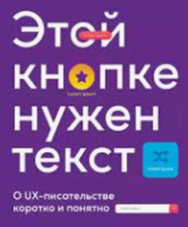

# Как я стала техническим писателем

## Обо мне

Все началось с раннего детства: в три года моя бабушка научила меня читать по слогам, в первом классе я уже была не понаслышке знакома с собранием сочинений Джека Лондона и Роберта Стивенсона, в средней школе писала стихи и поэмы, а в старшей мои опусы даже издавались в местном «Альманахе».

Как ты уже успел догадаться, дорогой читатель, моими школьными фаворитами были такие дисциплины, как русский язык и литература, сегодня в каждой комнате моей квартиры есть библиотечные шкафы, а еще я тот самый невыносимый человек, который вечно всех исправляет и к кому обращаются с просьбой о помощи в написании обращений, поздравлений и пр.

В какой-то момент мне показалось, что вся вселенная словно кричит мне о том, что я создана для изучения, написания, структурирования и редактуры текстов.

Я люблю не только читать, но и делиться прочитанным, обсуждать впечатления и выводы, сделанные после знакомства с содержанием книги. Пару лет назад я вступила в книжный клуб и с тех пор безумно благодарна команде единомышленников за возможность видеть сюжеты с разных сторон, всегда дочитывать книги до конца (признаюсь честно, раньше я могла начать читать сразу несколько книг и ни одну из них не закончить) и даже устраивать совместные просмотры экранизаций особенно впечатливших нас произведений!

Еще один занятный факт биографии: мой старший сын-подросток тоже организовал книжный клуб среди своих одноклассников, в котором они читают не абы что, а Анну Франк «Дневник в письмах» и книги по финансовой грамотности. 
Как тебе такое, Илон Маск? Недалеко яблочко от яблоньки приземлилось?

## Почему я решила стать именно техническим писателем, а не журналистом, копирайтером или редактором

Количество копирайтеров и лайфстайл-блогеров экспоненциально растет с каждым днем, а переписывать одно и то же и лезть из кожи вон, чтобы удержать внимание читателя мне не хотелось. Именно поэтому я приняла решение пойти сложным путем и стать узкоспециализированным экспертом, освоив написание технической документации.

Хотя, признаюсь честно, гораздо труднее мне было бы демонстрировать «фотографию рабочего дня», вываливать на растерзание подписчиков содержимое директа и комично скакать на видео, пытаясь попасть пальцами в сторону всплывающих вмонтированных слов в запрещенной на территории РФ сети. 

Поводом для столь неожиданного выбора новой профессии стала случайная встреча с давней приятельницей на вечеринке у общих друзей. Мы разговорились, я посетовала на декретный «день сурка», а она в ответ начала так вдохновенно рассказывать о своей работе мечты, что в тот момент в самом ядре моей познавательной системы словно щелкнул тумблер: «Алоха, человек! Тебе туда!». Так я узнала о профессии технического писателя и устремилась в сторону ее незамедлительного освоения.

В тот же день я обновила резюме, составила сопроводительное письмо и атаковала каналы по поиску работы, параллельно с этим жадно поглощая всю информацию о техписательстве в интернете. К досадному недоразумению, HeadHunter не отвечал мне взаимностью. Спустя неделю отказов, я сделала вывод о том, что поиск работы даже на позицию junior оказался довольно нетривиальной задачей.

Скорее всего потенциального работодателя отталкивало отсутствие релевантного опыта в моей карьере, ведь до этого я в основном работала в государственных корпорациях – Департамент добрых дел Правительства Москвы, Минспорт России. Всю мою профессиональную жизнь меня преследовала работа с документацией правового характера – регламенты, приказы, постановления, аналитические справки и методические пособия. Однако, чтобы стать техписом, нужно изрядно потрудиться и прокачать технические навыки.

К слову сказать, из министерства спорта я вынесла не только знания и опыт работы с огромным количеством документов.
Кажется, нет ничего удивительного в том, что моя честолюбивая душонка выбрала для себя один из самых величественных и интеллектуальных видов спорта – фехтование на шпагах.

Ну вы поняли, да, что я не из тех, кто сдается на полпути? 

Чтобы сформировать себе достойное портфолио, я пошла учиться в школу авторов Hexlet, школу редакторов Бюро Горбунова и прослушала открытый курс «Техническая документация в IT  проектах» от Documentat.io.

На моей книжной полке появились нетленки «Документирование программного обеспечения» Т.А. Макаровских, «Технический писатель или рыцари клавиатуры» А.В. Михайлова.

Для полного погружения в нетворкинг я подалась в волонтеры конференции TechWritersDays, на которой прослушала полезные доклады, обрела множество полезных знакомств среди спикеров и даже нашла себе отличного ментора, оказавшего мне колоссальную поддержку в укреплении своей позиции на рынке труда.

НАКОНЕЦ-ТО вселенная услышала мои молитвы и я ворвалась на стажировку в АО «КАМА». Мне посчастливилось оказаться единственным техписом в команде самых лучших аналитиков в мире. Мы вместе писали техническую документацию для первого серийного электромобиля-гаджета АТОМ в России.

С первого дня работы начался праздник взаимопомощи и труда и я радостно очертила себе доблестную миссию, состоящую из пунктов:

•	формирование культуры документирования в АО «КАМА»;

•	помощь пользователям;

•	повышение видимости работы техписателя в продуктовой команде;

•	популяризация профессии технического писателя.

## С чего я начала работу

С подробного изучения инструментов Atlassian – Confluence и Jira.

Погуляв по пространствам команд IT-департамента, были сделаны кое-какие выводы.
Первое впечатление – полный хаос и отсутствие понимания что, кем и для кого написано, неразбериха в процессах и зонах ответственности.

Я вывела топ-5 ошибок в документации:

1. Некорректная структура 

2. Неоднородные названия разделов и их содержание

3. Неправильно оформленные списки

4. Инструкции, не приводящие к нужному результату

5. Неграмотный текст

В части процессов обнаружились проблемы: неправильно поставленные и оформленные задачи, резкая смена их приоритетности по середине спринта.

Зоны ответственности специалистов также виделись довольно размытыми и требовали четкого очерчивания.

## Как я решала эти проблемы внутри своей команды Atomverse

Сначала совместно с лидом аналитики и остальными членами команды привела в порядок все пространство в части структуры, распределила всю информацию по разделам и подразделам, сделала красивое сегментированное меню с эмодзи, разместила плашки с нашими основными продуктами (некоторые команды даже спрашивали совета как им сделать так же красиво), убрала все недоработанное в архив, выбросила в корзину все лишнее.

### Разобралась для кого и с какой целью пишется документация

Для приведения всей документации пространства команды к единому стилю, составила стайлгайд, глоссарий и словарь проектных терминов.

**Стайлгайд** – руководство по стилю, описывающее правила работы с текстом, которое применяется для структурирования и оформления всей документации.

Все наши документы стали удобочитаемыми, консистентными, написаны в едином стиле и так называемом Tone of Voice (тон обращения к пользователю).

Стайлгайд помогает писать тексты грамотно и понятно, ускоряет онбординг новых сотрудников и сводит к минимуму возможные дискуссии о том, как правильно писать документацию.

**Словарь проектных терминов** и **глоссарий** нужны для упрощения поиска определений в нашей документации.

### Навела порядок в процессах

#### Описала процесс ревью документации

Мы использовали кросс-ревью с четырьмя видами вычитки в ролях новичка, опытного пользователя, редактора и технического писателя (подсмотрено в х5tech).

#### Написала гайд по процессам в Jira

Этот документ описывает правила создания и ведения задач в Jira. 
Он обеспечивает прозрачность взаимодействия участников внутри команды и с другими командами.

#### Утвердила шаблоны в Jira и инструкции к ним

О том, как структурировать и ускорить работу аналитиков, дизайнеров и разработчиков с помощью грамотно составленных тикетов в Jira, читайте <a href="https://crazy-techpeace.github.io/Vestaliya_Docs/processes/tikets-in-jira">здесь</a>.

### Инструменты по работе с персоналом

#### Матрицы компетенций для бизнес-аналитика, системного аналитика и технического писателя

Матрицы компетенций помогают собрать данные об уровне знаний, умений и навыков сотрудников и управлять профессиональном ростом с помощью руководителя, переходя на следующий уровень.

#### Должностные инструкции

Четко очерчивают права и обязанности: что должен знать, уметь работник, а также на что он имеет права.

#### Вопросы для самопроверки 

Применяются как на собеседованиях при подборе кандидатов, так и в качестве самоориентира.

#### Анкета с диаграммой 
 
Есть <a href="https://docs.google.com/spreadsheets/d/1Bqys-3YHDR5-3BXLqzmyKLNllG36gSWMjVyDSy72t-I/edit?gid=389342446#gid=389342446">инструмент</a>, который наглядно демонстрирует зоны роста сотрудника после ответов на вопросы.

#### База знаний 

Здесь собрана вся информация, помогающая аналитикам и техническим писателям: книги, учебные курсы, записи митапов, ссылки на профессиональные сообщества, вебинары и пр.

Все эти документы, взаимоувязанные между собой и созданные с опорой на профстандарты, облегчают карьерный путь аналитиков и техписов и помогают быстрее достичь намеченных целей.

Благодаря им руководитель может формировать более понятный и управляемый рост для сотрудников, расставляя приоритеты в развитии и более эффективно выстраивать рабочие процессы.

И, конечно же, внедрение таких инструментов оказывает влияние на корпоративную культуру всей компании, ее имидж и развитие бренда.

Обо всех этих шагах я рассказала на митапе в рамках центра компетенций «Системный анализ», дебютировав с докладом по технической документации.

В завершении своего доклада я поделилась рекомендациями книг, облегчающих работу с текстом. Одну из них я даже разыграла среди авторов самых каверзных вопросов.

   

Про то, как мы проводили исследование по документации, внедряли подход docs as code и поднимали базу знаний для разработчиков читайте в следующей статье.

