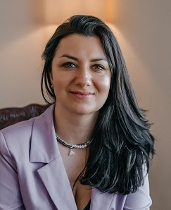

Привет, интернет! 

Меня зовут Весталия и я в поиске новой работы техническим писателем.
Предпочтителен удаленный формат с посещением офиса при необходимости. 

Грейд миддл+.
Нахожусь в Москве.

Последние полтора года работала в АО "КАМА" (производство первого российского электромобиля-гаджета Atom) 
и **вот что я успела за это время**: 

* описала процессы взаимодействия между подразделениями с нуля;

* придумала стайлгайд и шаблоны в Confluence и Jira;

* внедрила подход docs as code совместно с аналитиками (первая команда в IT-департаменте);

* создала базу знаний для разработчиков на основе проведенных исследований;

* написала пользовательскую документацию совместно с аналитиками и продакт-менеджерами; 

* запустила серию митапов по технической документации в рамках центра компетенций "Системный анализ";

* разработала карту компетенций для технических писателей, системных и бизнес-аналитиков.

Работала также в государственных и коммерческих структурах - Минспорт России, ДТСЗН Правительства Москвы, РУССЛАВБАНК, Металлинвестбанк, ЭЛКОД и др. Писала НПА, методические пособия и аналитические материалы.

Если у вас есть подходящая вакансия или рекомендация — буду признательна за контакт или репост.
Связь: @vestaliyam или vestaliyas@mail.ru.

