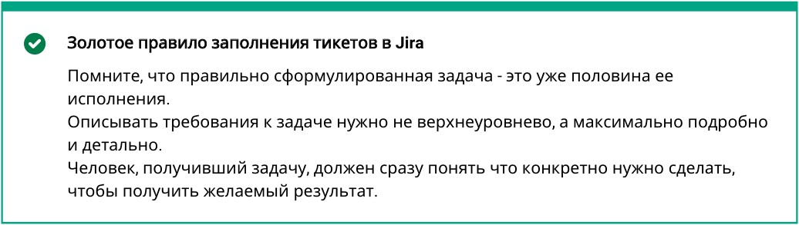
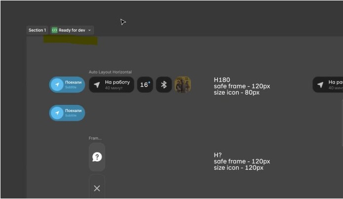

# Инструкция к заполнению тикетов в Jira

Этот документ описывает правила заполнения тикетов в Jira для облегчения работы команд 
аналитики, дизайна и разработки.

В процессе заполнения тикетов опирайтесь на принципы постановки задач по **SMART**. 

 Чтобы соответствовать **SMART**, задача должна быть:

 * **Конкретной** (Specific) — точно обозначать действия, которые нужно сделать.

 * **Измеримой** (Measurable) — отражать масштаб работ в количественном выражении. Это поможет понять, когда цель будет достигнута.

 * **Достижимой** (Attainable) — рассчитанной на те ресурсы, которые есть в распоряжении исполнителя.

 * **Актуальной** (Relevant) — соответствующей целям постановщика задачи и здравому смыслу.

 * **Ограниченной по времени** (Time Based) — задающей конкретные сроки.
 
 ## Как правильно заполнять тикеты в Jira

 Чтобы эффективно управлять задачами, воспользуйтесь шаблоном задачи и инструкцией к его заполнению по каждому направлению.

 ## **Шаблон задачи(общий)**

 **Контекст:**

 *Текст*

 **Требования к результату:**

 *Текст*

 **Скоуп задачи:**

 *п.1
 п.2
 п.2.2*

 **Ограничения:**

 *Текст*

 **Стейкхолдеры:**

 *Текст*

 **Исходные данные:**

 *Текст*

 **Результаты:**

 *Ссылки на артефакты*
 
 ## **Инструкция по заполнению шаблона задач для аналитиков/дизайнеров/разработчиков**

 **Контекст**

 *Краткая информация о ситуации и проблемах, из-за которых возникла стоящая перед вами задача, «боль» в рамках бизнес-ситуации.*  

 **Требования к результату**

 *Описание того, что именно нужно включать в анализ/дизайн/разработку.*
 *Четко установленные критерии, по которым будет оцениваться результат.* 
 *В каком виде нужно оформить конечный продукт.*

 **Скоуп задачи**

 *Нумерованный список с последовательностью действий по выполнению задачи.*

 **Ограничения**

 *Этот блок очерчивает барьеры решения, например, географические, финансовые, законодательные. Это могут быть ограничения по использованию источников и инструментов.*

 **Стейкхолдеры**

 *Это перечень людей, которые могут влиять на решение задачи. Их можно разделить на тех, кто принимает решения, помогает или мешает.*

 **Исходные данные**

 *Здесь должен быть перечень ссылок на исходные материалы с данными для решения задачи.* 
 *Например, книги, документы, исследования, ключевые эксперты, к которым можно обратиться за помощью, информация об аналогичных проектах.*

 **Результаты**

 *Ссылки на артефакты, которые должны получиться на выходе.*

 ***Для аналитики:***

 * ссылка на страницу в Confluence, Devprom
 * схема BPMN, UML с описанием
 * текстовый документ

 ***Для дизайна:***

 * функциональная модель (опционально)
 * Функциональная архитектура (опционально)
 * информационная архитектура (опционально)
 * Job/User stories
 * User roles
 * CJM
 * Wireframes
 * Результаты Usability tests
 * User flow

***Для разработки:***

Текстовое описание выполненной работы: что конкретно сделано на бэкенде и фронтэнде.  

***При передаче материалов от дизайна к разработке***

Для материалов, которые публикуются в фигме (или ее аналоге) материалы передаются 
в режиме Ready for dev:

Для материалов, которые публикуются в Confluence, обязательно проставление владельца 
артефакта и двух последних версий на странице:

Изменение в опубликованных материалах возможно только с согласия исполнителя задачи 
и должно фиксироваться в комментарии к ней.

### **Пример задачи для аналитика**

**Задача**

В рамках текущего спринта провести анализ UC бэклога на наличие UC в статусах Declined, создать дополнительный столбец в файле бэклога и отметить UC со статусами Declined, Declined Extention, Deprecated.
 
**Контекст**

*Для актуализации бэклога определить UC в статусе Declined*

**Требования к результату**

 *Результат оформить в виде таблицы в Confluence.*
 *Состав столбцов: ID UC,описание, комментарий о причине закрытия UC.*

 **Скоуп задачи**

 1. Открыть Devprom;

 2. Открыть все UC с фильтрами Mobile;

 3. Применить фильтр Declined;

 4. Выгрузить все UC;

 5. Разместить полученный результат в текущем бэклоге.

 **Ограничения**

 *Без ограничений*

 **Стейкхолдеры**

 *Весталия Морозова*

 **Исходные данные**

 *Ссылка на Devprom со всеми UC: A-Mobile12345/Atomverse(e-kama.com).* 

 *Ссылка на текущий бэклог: Доска Agile-Jira(e-kama.com).*

 **Результаты**

 *Ссылка в Confluence на заполненную таблицу.* 

### **Пример задачи для дизайнера**

**Задача** 

*Сделать дизайн флоу установки, обновления и удаления мобильного приложения.*

**Контекст**

*Создать дизайн приложения для трех видов тачпоинтов: SWP, HUD и смартфон.*

**Требования к результату**

*Отрисованный дизайн в Figma*

 **Скоуп задачи**

 *1. С учетом собранных и описанных аналитиками требований отрисовать дизайн;*

 *2. Согласовать с дизайн-лидом;*

 *3. Передать в разработку;*

 **Ограничения**

 *Возможен вариант с уточнением трубований в процессе работы, замедляющий работу*

 **Стейкхолдеры**

 *Мария Иванова, Дарья Сидорова, Иван Петров*

 **Исходные данные**

 *UX-спецификация по HUD (link)* 

 *UX-спецификация по SWP (link)* 

 *UX-спецификация по Mobile (link)* 

 **Результаты**

 *Ссылка в Figma c отрисованным дизайном, размещенная в пространстве Confluence.* 

### **Пример задачи для разработчика**

**Задача** 

*Провести технический анализ инструментов проверок и определить их список для интеграции в наши продукты.*

**Контекст**

*Во время загрузки АРК-файла есть четыре типа проверок:* 

*1. SAST (статистический анализ кода)*

*2. DAST (динамический анализ кода)*

*3. Kaspersky Serch Engine (обнаружение вирусов)*

*4. SCA (проверка на сторонние библиотеки в коде)*

**Требования к результату**

*Оформленный список инструментов в виде таблицы.*
*Состав столбцов: тип проверки, название инструмента, ссылка на инструмент, аргументы выбора.*

 **Скоуп задачи**

 *1. Изучить все инструменты;*

 *2. В случае недостатка информации провести исследование;*

 *3. Взвесить все преимущества и недостатки;*

 *4. Заполнить таблицу;*

 *5. Разместить полученный результат в Confluence.*

 **Ограничения**

 *Возможная необходимость проведения исследований в случае отсутствия готовой информации*

 **Стейкхолдеры**

 *Иван Петров*

 **Исходные данные**

 *Исследования по продуктам (link)* 

 *Информация по продуктам Kaspersky (link)*

 **Результаты**

 *Ссылка в Confluence на заполненную таблицу.* 
