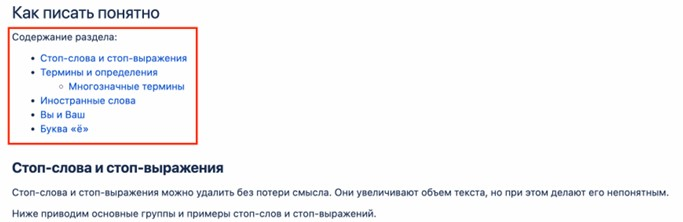
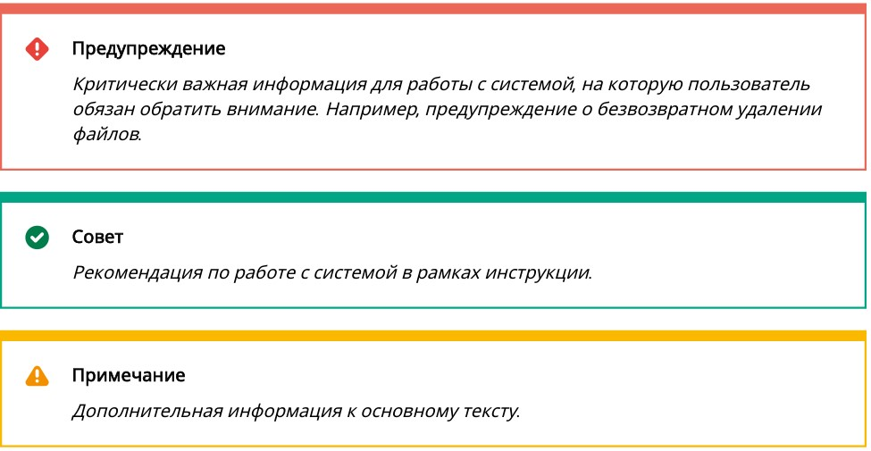
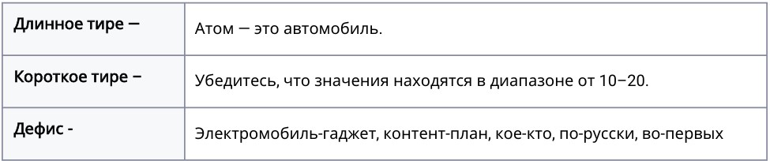

# **Введение**

Этот документ определяет базовые принципы работы с документаций и помогает поддерживать единый стиль.

## **Общие принципы**

При создании и ревью документации опирайтесь на **пять принципов**:

**1. Краткость и простота изложения** 

Пишите доступно и лаконично. В активном залоге, без канцеляризма.
 
**2. Структура**

Используйте емкие заголовки, разбейте текст на абзацы, а длинные предложения разбейте на короткие.
Действия пользователя должны быть последовательными и приводить к конкретному результату. 

**3. Грамотность**

Перед тем, как начать писать документ, прочитайте этот Стайлгайд. 
Во время написания текста пользуйтесь ресурсами из нашей подборки, которые помогут писать правильно 
и понятно. После написания документа просите коллег вычитать ваш текст перед публикацией — этот процесс называется кросс-ревью. Эти шаги помогут сделать текст более грамотным.

**4. Стилистика** 

Придерживайтесь единой тональности, одинаково оформляйте ссылки, списки, плашки, врезки, примечания 
и картинки.

**5. Польза и удобство для читателя**

Объясняйте сложное простыми словами. Не используйте узкопрофессиональные термины, не вдавайтесь в детали, которые не соответствуют цели и заголовку документа.

## **Внешний вид документации в Confluence**

Единый стиль оформления помогает читать документацию и узнавать важную информацию 
о ней: имя владельца, статус и дату изменений. В этом разделе описаны обязательные элементы в Проектной документации и правила их оформления.

### **В начале документа**

В статье Confluence в разделах Проектной документации должны быть элементы:

#### **Оглавление**

Чтобы добавить оглавление, используйте макрос «Оглавление». 

Если оглавление очень длинное, используйте макрос «Раскрыть». 
Используйте «Оглавление» в качестве заголовка при использовании макроса.

#### **Табличка с версиями документа**

Используйте макрос «Изменить статус» и настройте его, чтобы было видно два последних изменения.

#### **Табличка с владельцем документа, его статусом и датой начала работы над ним**

 Чтобы оформить статусы, используйте макрос «Статус». Возможны три статуса:

 IN PROGRESS — синего цвета

 REVIEW – желтого цвета

 DONE — зеленого цвета

Чтобы расположить оглавление и версии текста рядом на странице, используйте функцию «Разметка страницы»

**Пример оформления**

### **В документе**

Если разделы вашего документа содержат несколько подразделов, делайте оглавление каждого 
раздела в начале. К каждому подразделу добавьте ссылку. 

**Пример оформления**

### **В конце документа**

В конце документа обязательно включите раздел Артефакты и связанные материалы — туда 
добавляйте ссылки на материалы, которые вы использовали при подготовке документа.

Они помогут получить более подробную дополнительную информацию по теме.

Добавляйте артефакты:

 • ссылки на задачу в Jira;

 • ссылки на схемы в Figma, BPMN или Miro;

 • электронные письма с информацией по документу;

 • ссылки на другие документы, которые помогут лучше понять ваш документ.
 
**Внешний вид таблички:**

Название и ссылка |Описание | Комментарий
:--- | :--- | :---
Здесь укажите полное название и оформите ссылку.    Например: Схема взаимодействия.|Опишите в 1–2 предложениях,что это за материал или другой артефакт | Необязательное поле. В нем напишите то, что, как вы считаете, важно упомянуть.   Например: Описывает взаимодействие команд Atomverse.  Например: Обновили схему 01.01.1900. В будущем планируется доработка.
 
#### **Комментарии**

Когда вы оставляете комментарии к документации коллег, используйте комментарии к тексту:

Если вашу статью прокомментировали, после проработки комментария по согласованию 
с комментатором переведите комментарий в статус решенного. Не оставляйте неразрешенные 
комментарии после перевода документа в статус DONE.

Если после финализации документа остаются нерешенные вопросы, оставляйте 
их в информационных блоках. Вы также можете вынести список нерешенных вопросов в отдельный 
блок в конце документа. 

**Важно:** для нерешенных вопросов пишите, почему или кем они заблокированы, а также условия 
и примерные сроки решения. Если есть ссылки на артефакты, которые могут дать 
дополнительную информацию, оставляйте ссылки на них.

## **Написание документации**

### **Сначала**

Перед тем, как начать писать документ, ответьте на два вопроса:

1. Кто будет его читать? 
Это могут быть члены вашей команды или коллеги из других команд. 
Держите вашу целевую аудиторию в центре внимания при написании документа.

2. Зачем его читать? Какая проблема должна решиться? 
Планируйте документ так, чтобы цель читателя была достигнута.

### **Оформление**

#### **Структура**

Используйте заголовки 1-го, 2-го и 3-го уровней. 
Это поможет структурировать документ и сделать его удобным для читателя. 

В начале документа сделайте введение. 
Во введении коротко расскажите, о чем этот документ, кому он может быть полезен.

Используйте предварительные условия для инструкций. Если предварительные условия 
описаны подробно в других статьях, добавьте ссылку на эти статьи. В конце инструкции четко 
указывайте результат, к которому должен прийти читатель.

#### **Абзацы**

Чтобы текст не был сплошным, разбивайте его на абзацы с использованием заголовков 
и подзаголовков. Руководствуйтесь принципом «Один абзац – одна мысль».

Не путайте абзац с заголовком. Абзац разделяет несколько мыслей одной темы, заголовок 
разделяет разные темы.

#### **Списки**

Создавайте списки для оформления порядка действий, обобщения, перечисления более трех 
предметов и сущностей.

Есть два вида списков: нумерованные — с цифрами или буквами, и маркированные — без цифр и 
букв.

**Нумерованный список** описывает порядок действий, последовательность или приоритеты. 
Пункты нумерованных списков начинаются с заглавной буквы и заканчиваются точкой. 

**Пример:**

 1. В меню **Файл** выберите **Открыть базу данных**.

 2. В поле **Имя пользователя** введите ваше имя.

 3. В поле **Пароль** введите ваш пароль, затем нажмите **ОК**.
 
**Обязательно нумеруйте шаги процесса.** 

**Пример:**

Чтобы начать работу, выполните шаги:

**Шаг 1.**

Откройте ноутбук. 

**Шаг 2.**

Нажмите кнопку включения.

**Шаг 3.**

Введите ваш пароль для входа.

Или:

Чтобы, включить ноутбук, выполните шаги:

1. Откройте ноутбук.

2. Нажмите кнопку включения.

3. Введите пароль для входа.
 
**Маркированный список** перечисляет варианты или набор требований или характеристик без 
последовательности. Пункты маркированных списков могут начинаться с маленькой буквы, и тогда они заканчиваются точкой с запятой. 

Если маркированный список состоит из предложений, они также могут заканчиваться точкой, и тогда каждый следующий пункт начинается с большой буквы.

Если в списке более 10 пунктов, сделайте такой список раскрывающимся, это визуально 
сократит статью.

**Пример:**

 У владельца базы данных есть возможность:

 • создавать и удалять базу данных;

 • добавлять, удалять или редактировать документы;

 • изменять любую информацию.

#### **Ссылки**

Используйте краткий, но содержательный текст для ссылок. Используя заголовок или описание 
страницы, вместо общих фраз, таких как «нажмите здесь». 

**Примеры**

❌Как не писать |✅Как писать
:--- | :--- 
Нажмите **здесь**, чтобы узнать больше о стоп-словах при написании текста.   Здесь можно узнать, как оформлять адресы и телефоны: **https://confluence.e-kama.com/pages/viewpage.action?pageId=105452152#idСтайлгайд-Контакты,телефоны,адреса** | В разделе **Как писать понятно** можно почитать о стоп-словах подробнее.  В разделе **Контакты, телефоны, адреса** есть примеры оформления.
 
#### **Картинки**

Изображения, скриншоты, логотипы и значки делают инструкции понятнее. Они помогают 
пользователю лучше ориентироваться в интерфейсе систем и сервисов. Добавляйте их, когда 
текстового описания недостаточно.

Значки используйте для замены текстового описания элементов интерфейса.

Изображение на скриншоте должно быть читаемым и отражать реальный интерфейс, 
а не макет приложения или системы. Если на скриншоте есть настоящие данные пользователей, 
обязательно удалите их.

**Правила оформления картинок:**

- Скриншоты одного раздела должны быть одинаковыми по ширине.

- На рисунках выделяйте те элементы интерфейса, про которые идет речь в тексте.

- Выделяйте элементы интерфейса квадратной рамкой красного цвета.

- Стрелки на рисунках должны быть красного цвета.
 
#### **Названия кнопок**

Используйте полужирный шрифт без кавычек для названия кнопок.
Если у кнопки нет названия, вставьте иконку.

#### **Названия полей, разделов, опций и действий** 

Используйте **жирный шрифт** в названиях полей, разделов, опций и действий.

Примеры:

 • Документация по продуктам находится в разделе **Проектная документация**.

 • В поле **Пароль** введите пароль.
 
#### **Информационные вставки**

Используйте информационные вставки для привлечения внимания читателя к важной 
информации в документации. Используйте макросы Предупреждение, Подсказка и Примечание.

**Примеры**

 
Используйте информационные вставки, когда:

* хотите дать полезную информацию или совет, который поможет лучше понять 
содержимое;

* хотите привлечь внимание к важной информации. 
Например, нужно обратить внимание на особые условия или выделить важные взаимосвязи;

* хотите показать, что есть серьезные ограничения или блоки. В этом случае нужно явно 
указать сроки решения, если сроков нет — написать об этом.

<mark>Не используйте информационные вставки, когда нужно привлечь внимание коллег к 
тому, что требует доработки в документации. Информационные блоки — не средство 
общения по документу. Чтобы задать вопрос или прокомментировать часть 
документа, используйте комментарии.<mark>

#### **Дата, время и место**

##### **Время и дата**

Пишите время цифрами с двоеточием между часами и минутами — 15:30.

Дату пишите также цифрами — 21.05.2024.

##### **Контакты, телефоны, адреса**

Пишите в формате:

Тел.: 8 (800) 123-45-67

Адрес: Москва, Холодильный пер., 6-1

Эл. почта: hr@atom.team

Ссылки на социальные сети размещайте в виде QR-кодов или кнопок.

## **Как писать понятно**

### **Стоп-слова и стоп-выражения**

Стоп-слова и стоп-выражения можно удалить без потери смысла. 
Они увеличивают объем текста и делают его непонятным. 

Основные группы и примеры стоп-слов и стоп-выражений:

**Примеры**

❌Как не писать |✅Как писать
:--- | :--- 
Это **суперскоростной** автомобиль.  Настраивайте **абсолютно** все параметры вручную.   Этот метод **является эффективным решением** для обработки больших объемов данных.  Модуль предоставляет **различные функции** для анализа данных.| Этот автомобиль развивает скорость до 300 км/ч.  Настраивайте все параметры вручную.  Этот метод позволяет обрабатывать большие объемы данных с высокой скоростью.  Модуль предоставляет функции для анализа данных, такие как фильтрация и сортировка.

### **Термины и определения**  

Объясняйте термины, которые могут быть незнакомы целевой аудитории. Не заменяйте 
введенный термин синонимами.

Все термины и сокращения, которые мы используем в работе, изложены в Глоссарии и Проектных терминах. 

При первом упоминании термина в документе давайте его определение. 

Если определение очень длинное, можно дать ссылку на термин в Глоссарии или Проектных 
терминах.

#### **Многозначные термины**

В документах часто приходится использовать термины, которые имеют много значений в 
зависимости от контекста, от компании и даже от проекта.

Вот список основных:

 * Клиент

 * Сервис

 * Сервер

 * Интерфейс

 * Пользователь 

 * Асинхронность
 
С осторожностью используйте такие слова: заменяйте их, когда возможно. Если заменить такой 
термин невозможно, определите его в начале документа.

### **Иностранные слова**

Старайтесь не перегружать текст иностранными словами. Иначе людям, которые не владеют 
английском, будет сложно понять документ.

 ❌ экспертиза, митинг, юзкейс, спека

 ✅ экспертная область, встреча, сценарий использования, спецификация
 
Список терминов, которые приняты в компании есть в Проектных терминах. 

Если вы используете иностранные слова в тексте, пишите их кириллицей (русскими буквами). 

В таблице приводим несколько правил написания иностранных слов

**Правило** |**Пример**
:--- | :--- 
Пишите иностранные слова русскими буквами. | аджайл  апгрейд  бэкэнд
Распространенные аббревиатуры можно оставлять на латинице. | UI/UX  PR  HR
Пишите сложные иностранные слова через дефис вне зависимости от того, на русском они или на английском. Исключение — слова, которые мы знаем уже давно. Их написание становится ближе к правилам русского языка. Исключений становится больше, проверяйте в словаре, если сомневаетесь.| UI-дизайнер  интернет-маркетинг  CММ-менеджер онлайн-шопинг  **Исключения:** вебсайт  мультимедиа
Названия компаний, брендов и их продуктов на английском языке в русском тексте пишутся без кавычек.| Это продукт компании Microsoft.  Весь дизайн команда делает в Figma.|  

### **«Вы» и «Ваш»**

«Вы» и «Ваш» пишем с большой буквы только в начале предложения. В остальных случаях — с 
маленькой.

### **Буква «ё»**

Пишем «е» во всех случаях, когда ее использование не вызывает разночтений. 

Если слово без «ё» и с ней имеет разное значение, пишем «ё». 

Например: все и всё. Но: еще, объем, съемка.

### **Элементы интерфейса и действия в нем**

Нажмите кнопку, а не нажмите на кнопку.

Пройдите по ссылке, а не нажмите на ссылку.

Наведите курсор, а не наведите мышку.

### **Речевые обороты**

Важно, чтобы текст воспринимался ясно и однозначно и не было разночтений.
Для этого длинные предложения разбивайте на короткие. 
По возможности не используйте причастные b деепричастные обороты — они усложняют понимание и часто приводят к ошибкам.

**Примеры**

❌Как не писать |✅Как писать
:--- | :--- 
Для обновления системы необходимо скачать новый файл и установить его, следуя инструкциям.| Для обновления системы скачайте новый файл. После этого установите его по инструкциями. 
Нажимая на кнопку Далее, вы перейдете к следующему шагу. | Нажмите кнопку Далее, чтобы перейти к следующему шагу.
Приложение, установленное на устройстве, должно быть обновлено до последней версии перед началом работы. | Перед началом работы обновите приложение до последней версии.

### **Знаки препинания**

#### **Кавычки**

Используйте кавычки «елочки» для прямой речи и цитат. 

Не используйте кавычки "лапки" для русского текста.

#### **Тире и дефис**

Используйте длинное тире для упрощения предложения и пояснения сказанного.
Используйте короткое тире, чтобы обозначить интервал или знак «минус».
Используйте дефис для присоединения частиц или префиксов, в словосочетаниях и сложносоставных словах.

#### **Скобки**

В скобках обычно размещается второстепенная информация. Если она важная, вытаскивайте ее 
в отдельное предложение, если нет, то удаляйте вместе со скобками.

**Примеры**

❌Как не писать |✅Как писать
:--- | :--- 
После выполнения этой команды (выполняется через терминал) система перезагрузится.| После выполнения этой команды через терминал система перезагрузится.
Проект должен быть завершен в срок (до 30 сентября). | Проект должен быть завершен в срок до 30 сентября.

#### **Прочие знаки препинания**

**Точка с запятой:** используйте точку с запятой только в маркированном списке. 
Если вы разделяйте предложение точкой с запятой, разбейте это предложение на два коротких.

**Многоточие:** разработчики используют многоточие в тексте, чтобы показать, что после нажатия 
на кнопку откроется диалоговое окно. Мы — нет.

**Восклицательный знак:** не используйте восклицательный знак в документации. 
Восклицательные знак воспринимается как разговор на повышенных тонах.

**Примеры**

❌Как не писать |✅Как писать
:--- | :--- 
Убедитесь, что вы установили все необходимые зависимости перед запуском программы!| Убедитесь, что вы установили все необходимые зависимости перед запуском программы.
Обновите систему до последней версии; также необходимо провести тестирование на совместимость с оборудованием. | Обновите систему до последней версии. Затем протестируйте систему на совместимость с оборудованием.

#### **Числительные**
 
##### **Числа vs. слова** 
 
**Правило** |**Примеры**
:--- | :--- 
В заголовках числа пишите цифрами — так короче и нагляднее.| 5 фактов об электромобилях, которые вы могли не знать. 
В остальных случаях цифры от нуля до девяти пишем прописью.  Начиная с 10 — цифрами.|10 скриншотов  пять баз данных
Пишите числами диапазоны, «разы», даты, измерения, проценты, номера разделов и страниц, время, миллионы | от 6 до 8 лет  4 раза  3 сентября  2 м   глава 3 страница 4  5 миллионов 
Если один из объектов требует числительного, используйте числительные для всех остальных объектов тоже.|В первой статье 16 страниц, во второй — 7 страниц.

##### **Наращивание**

**Правило** |**Примеры**
:--- | :--- 
Наращивание числительных нужно только для порядковых числительных: отвечают на вопрос: какой по счету?| на 5-й день  25-я годовщина  1980–1990-е годы  **Важно:** в 2023-м, но в 2023 году
Наращивание не требуется при записи количественных числительных — отвечают на вопрос: сколько?, — календарных чисел и в номерах томов, глав, страниц.| список из 15 пунктов  10 ноября 2023 года  на с. 16, в табл. 2
 
##### **Большие числа**
 
 Четырехзначные числа пишите слитно. Пятизначные и более числа пишите с разделителем.
 
 Примеры:

 4559

 9999

 10 000

 452 000

##### **Диапазоны**

Между числами ставьте среднее тире без пробелов, если числа написаны цифрами, и дефис — 
если прописью (буквами).

Пример:

3–4 дня

но три-четыре месяца

Числительные – 24

## **Полезные сервисы для работы с текстом**

**Сервис** |**Чем полезен**|**Как работает**
:--- | :--- | :--- 
[Главред][https://glvrd.ru/]| Проверяет текст на стоп-слова и читаемость.|Нужно добавить текст на портал, а сервис подскажет, что можно улучшить.
<a href="https://www.artlebedev.ru/typograf">Типограф</a>| Убирает лишние пробелы, привязывает союзы и предлоги к словам.|Нужно вставить текст на портал, и сервис подскажет, что изменить.
<a href="https://languagetool.org/ru">LanguageTool</a>| Проверяет грамматические и орфографические ошибки.| Нужно добавить текст на портал, и сервис подсветит слова с ошибками.
<a href="https://gramota.ru/">Грамота</a>| Здесь можно почитать правила русского языка: от грамматики до стилистики.| Нужно зайти на сайт и найти интересующее правило с примерами.
<a href="https://www.slovorod.ru/orth-lopatin/index.html">Орфографический словарь Лопатина</a>| Большой словарь с грамматическими правилами, правилами ударений и многим другим | Нужно зайти на сайт и найти интересующее слово.
<a href="[https://sherer.pro/pets/shablon-dlya-generacii-ikonok-i-skrinshotov/">Шаблон для генерации иконок и скринов от Павла Шерера</a>| Помогает красиво оформить иконки и скриншоты | Нужно добавить свой скрин в шаблон и сделать.
<a href="https://ilyabirman.ru/typography-layout/">Типографская раскладка Бирмана</a>| Упрощает постановку кавычек, тире и других знаков.| Нужно скачать и установить себе раскладки русского и английского языка.
<a href="https://www.grammarly.com">Grammarly</a>| Исправляет грамматические и пунктуационные ошибки в документации на английском языке. | Можно пользоваться в браузере: добавьте текст и сервис подскажет ошибки. Можно скачать desktop-версию и разрешение для браузера, чтобы проверять текст в Microsoft Word и Google Docs.
 
## Чек-лист для проверки текста перед публикацией
 
✅ Заголовки отвечают задаче и содержанию

✅ Введение описывает цель документа

✅ Все шаги в инструкции последовательны и описаны полностью

✅ Документ решает задачу читателя

✅ Не используются ложные предположения об уровне аудитории

✅ Структура документа логична и однородна по стилю

✅ Прослеживается единая тональность во всем документе

✅ Все процедуры работают и протестированы

✅ Нет излишних конструкций, перегружающих документ

✅ Списки проверены на корректность нумерации

✅ Используются только кавычки-елочки «» для текста на русском

✅ Графические элементы единообразны и совпадают с интерфейсом

✅ Текст на картинках и скриншотах легко читается

✅ Нет двойных пробелов, пробелов в начале строки и перед знаками препинания

✅ Проверена орфография, пунктуация и грамматика

✅ Все ссылки открываются корректно и ведут к нужной информации

✅ Обращение к пользователям единообразное во всем документе

✅ В тексте отсутствуют стоп-слова

✅ Термины и определения написаны верно

✅ Количество англицизмов сведено к минимуму

✅ Инструкции и кнопки оформлены по правилам

✅ Длинные списки оформлены в виде развернутых списков
